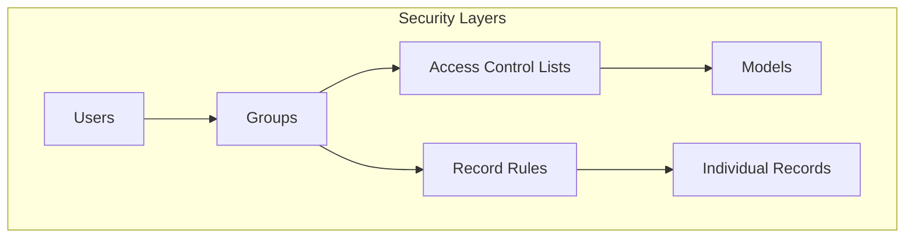

# Security

Access control and security definitions in purchase_fop_shipping.

## Access Control Lists (ACLs)

Model access permissions defined in:
- **[bosnian_translations.json](../bosnian_translations.json)**
  - 50 model access rules
- **[bosnian_translations_output.json](../bosnian_translations_output.json)**
  - 444 model access rules
- **[CHANGELOG.md](../CHANGELOG.md)**
  - 132 model access rules
- **[doc](../doc)**
- **[docker](../docker)**
- **[input](../input)**
- **[nix](../nix)**
- **[odoo.conf](../odoo.conf)**
  - 58 model access rules
- **[odoo_packages_bez_l10n.txt](../odoo_packages_bez_l10n.txt)**
  - 1947 model access rules
- **[odoo_packages_bringout.txt](../odoo_packages_bringout.txt)**
  - 1947 model access rules
- **[odoo_packages.txt](../odoo_packages.txt)**
  - 2085 model access rules
- **[output](../output)**
- **[packages](../packages)**
- **[README.md](../README.md)**
  - 338 model access rules
- **[scripts](../scripts)**
- **[temp](../temp)**
- **[TRANSLATION_BS_SUMMARY.md](../TRANSLATION_BS_SUMMARY.md)**
  - 146 model access rules

## Record Rules

Row-level security rules defined in:

## Security Groups & Configuration

Security groups and permissions defined in:
- **[res_groups.xml](../purchase_fop_shipping/security/res_groups.xml)**
  - 1 security groups defined

Security files overview:
- **[res_groups.xml](../purchase_fop_shipping/security/res_groups.xml)**
  - Security groups, categories, and XML-based rules

Notes
- Access Control Lists define which groups can access which models
- Record Rules provide row-level security (filter records by user/group)
- Security groups organize users and define permission sets
- All security is enforced at the ORM level by Odoo
