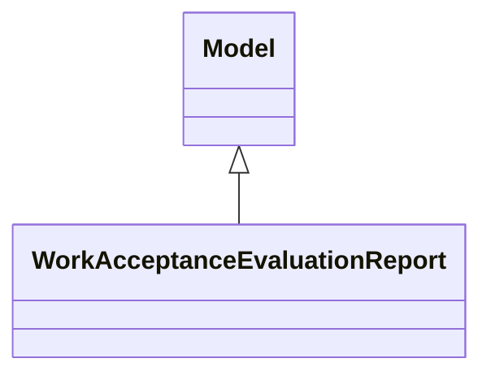

# Reports

Report definitions and templates in purchase_work_acceptance_evaluation.

## Available Reports

### Analytical/Dashboard Reports
- **Work Acceptance Evaluation Report** (Analysis/Dashboard)

## Report Files

- **__init__.py** (Python logic)
- **work_acceptance_evaluation_report.py** (Python logic)
- **work_acceptance_evaluation_report.xml** (XML template/definition)

## Notes
- Named reports above are accessible through Odoo's reporting menu
- Python files define report logic and data processing
- XML files contain report templates, definitions, and formatting
- Reports are integrated with Odoo's printing and email systems
