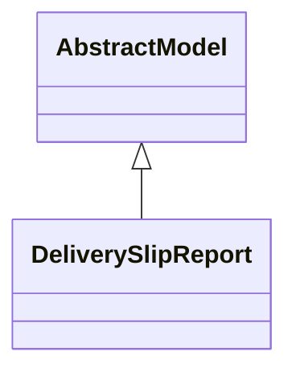

# Reports

Report definitions and templates in stock_picking_group_by_partner_by_carrier.

## Available Reports

No named reports found in XML files.

## Report Files

- **__init__.py** (Python logic)
- **report_delivery_slip.py** (Python logic)
- **report_delivery_slip.xml** (XML template/definition)

## Notes
- Named reports above are accessible through Odoo's reporting menu
- Python files define report logic and data processing
- XML files contain report templates, definitions, and formatting
- Reports are integrated with Odoo's printing and email systems
